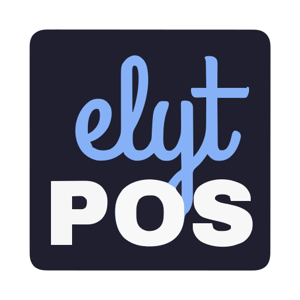
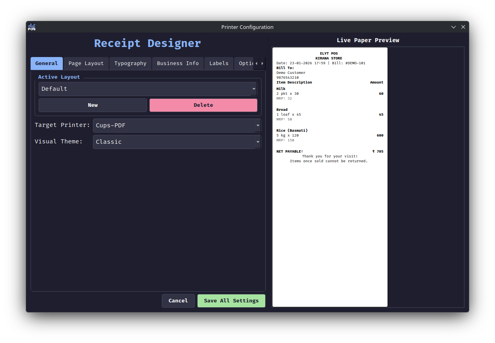
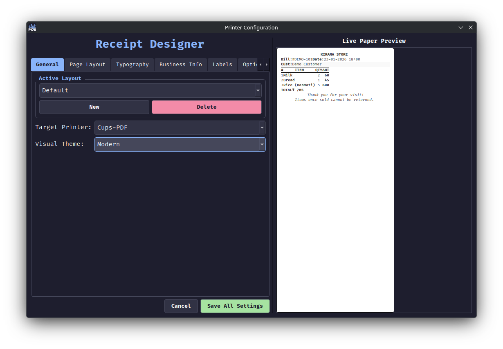
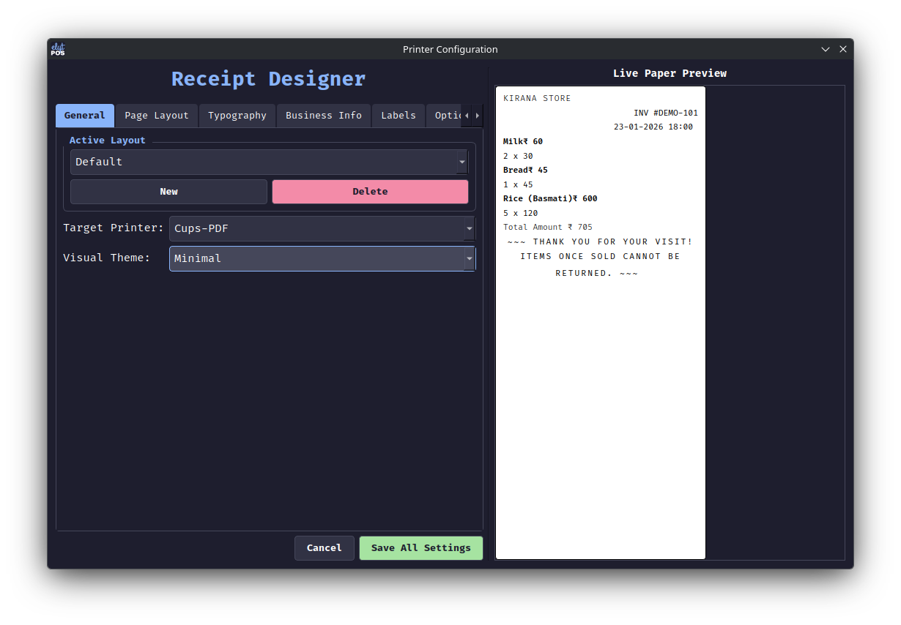

<p align="center">
  
</p>

<h1 align="center">elytPOS</h1>

<p align="center">
  <strong>A high-performance, keyboard-centric Point of Sale system for modern retail.</strong>
</p>

<p align="center">
  
  
  
  
</p>

---

## 🚀 Overview

**elytPOS** is a modern, efficient, and ergonomically designed Point of Sale (POS) system tailored for rapid retail environments. Built with **Python** and **PySide6**, it prioritizes speed and reliability through a sophisticated keyboard-centric interface and a robust **PostgreSQL** backend.

## ✨ Key Features

- ⚡ **Lightning Fast Billing:** Optimized for rapid, keyboard-driven data entry with minimal mouse reliance.
- 🏢 **Multi-Company Support:** Manage multiple businesses and financial years independently with automated database creation and switching.
- 📦 **Smart Inventory:** Comprehensive product management with support for barcodes, multiple UOMs (Units of Measure), and fuzzy search.
- 💰 **Dynamic Schemes:** Implementation of complex promotional rules, including percentage discounts, absolute rate changes, and bulk quantity offers.
- 👥 **Customer Relationship:** Integrated customer database with instant lookup and multi-year transaction history.
- 🖨️ **Advanced Receipt Designer:** Fully customizable bill layouts with live paper-style preview, multiple saved layouts, import/export capabilities, and professional themes (Classic, Modern, Minimal).
- 🔐 **Secure & Multi-User:** Role-based access control with encrypted password storage, fine-grained custom permissions, and automated database backups.
- 🧮 **Built-in Calculator:** Seamless, non-modal GUI calculator with live evaluation and operation chaining.

## 🔐 Security & Roles

elytPOS features a robust **Role-Based Access Control (RBAC)** system with three distinct roles: **Admin**, **Manager**, and **Staff**.

For a detailed breakdown of permissions, see [USER_ROLES.md](user_roles.md).

## 🌍 Multi-Language Printing

Provide a personalized experience by printing receipts in your customer's preferred language. The system automatically detects and simplifies the workflow, skipping extra steps if only one language is used. Manage languages and item translations easily through the integrated Translation Engine.

Learn more in [MULTILANGUAGE.md](multilanguage.md).

## 🎨 Appearance Themes

Customize your workspace with over 10 professional color schemes, ranging from the default **Mocha** dark theme to high-contrast **Latte** light mode and specialized palettes like **Nord**, **Dracula**, and **Gruvbox**.

Explore all options in [THEME.md](theme.md).

## 🖼️ Screenshots

### 🚀 Main Billing Dashboard

*Optimized for rapid data entry with real-time total calculation and fuzzy product search.*

### 🖨️ Advanced Receipt Designer
*Fully customizable bill layouts with live paper-style preview, multiple saved layouts, import/export capabilities, and professional themes (Classic, Modern, Minimal).*

### 🎨 Bill Themes
| Classic | Modern | Minimal |
| :---: | :---: | :---: |
|  |  |  |

View the full gallery of interface designs in [SCREENSHOTS.md](screenshots.md).

## 🛠️ Tech Stack

- **Frontend:** PySide6 (Qt for Python) with a custom modern dark theme.
- **Backend:** Python 3.11+.
- **Database:** PostgreSQL with `pg_trgm` extension for high-performance fuzzy matching.
- **Printing:** CUPS (Linux/macOS) / Direct Printing (Windows) with support for all sizes (Thermal 58mm/80mm, A4, A5).

## ⚙️ Installation & Setup

### 📦 Recommended: Pre-built Binary
The easiest way to run elytPOS is to download the latest executable for your operating system:
1. Go to the [Releases](https://github.com/elytraviii/elytpos/releases) page.
2. Download the binary corresponding to your OS (Linux, Windows, or macOS).
3. Run the executable. No Python installation required!

### 🛠️ Alternative: Run from Source
If you prefer to run the application using Python:

**Prerequisites:**
- Python 3.11 or higher
- PostgreSQL Server installed and running

**Steps:**
1. **Clone the Repository**
   ```bash
   git clone https://github.com/elytraviii/elytpos.git
   cd elytpos
   ```

2. **Setup Virtual Environment**
   ```bash
   python3 -m venv venv
   source venv/bin/activate  # Windows: venv\Scripts\activate
   ```

3. **Install Dependencies**
   ```bash
   pip install -r requirements.txt
   ```

4. **Launch**
   ```bash
   python main.py
   ```
   *The system will guide you through database and printer configuration on the first run.*

## ⌨️ Keyboard Shortcuts

| Shortcut | Action |
| :--- | :--- |
| **F2** | Save / Checkout / Record Purchase |
| **F3** | Smart Product Search |
| **F4** | Clear Current Entry |
| **F5** | View Sales History |
| **F6** | Hold Current Bill |
| **F7** | Recall Held Bill |
| **F8** | Open Integrated Calculator |
| **Ctrl + I** | Item Master (Inventory) |
| **Esc** | Close Dialog / Exit Application |

## 📜 License

This project is licensed under the **GNU General Public License v3.0**. See the [LICENSE](LICENSE) file for the full text.

## 🙏 Acknowledgments

- **[Frappe Books](https://github.com/frappe/books):** Special thanks for the inspiration behind our advanced bill formats and receipt themes.

---

<p align="center">
  Developed with ❤️ by <strong>Mohammed Adnan</strong><br>
  © 2026 Mohammed Adnan. All rights reserved.
</p>