# 🖼️ elytPOS Screenshots

This gallery showcases the comprehensive features and modern interface of elytPOS.

## 🔑 Security & Access
### Login Screen

> Secure multi-user login with role-based access control.

### User Management
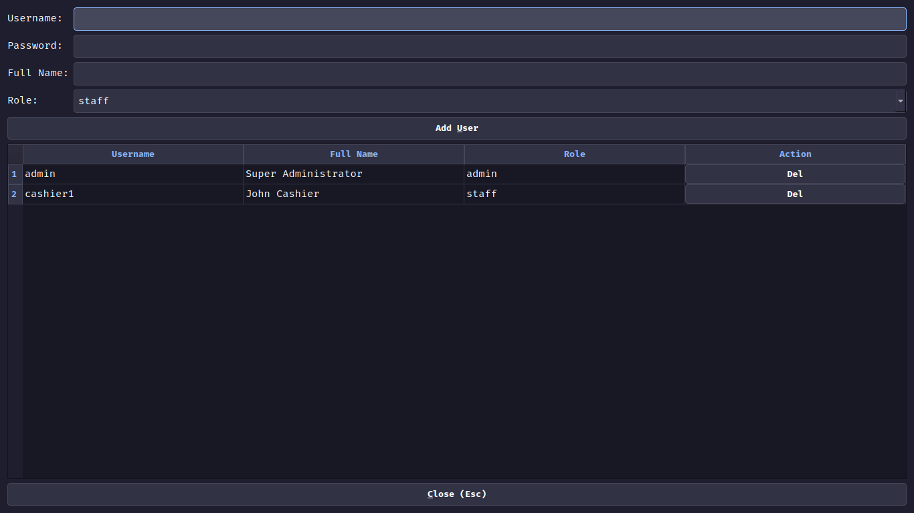
> Admin interface for managing system users and roles.

## 🚀 Billing & Sales
### Main Billing Dashboard

> The core interface for rapid billing, featuring keyboard-centric entry and real-time totals.

### Product Search
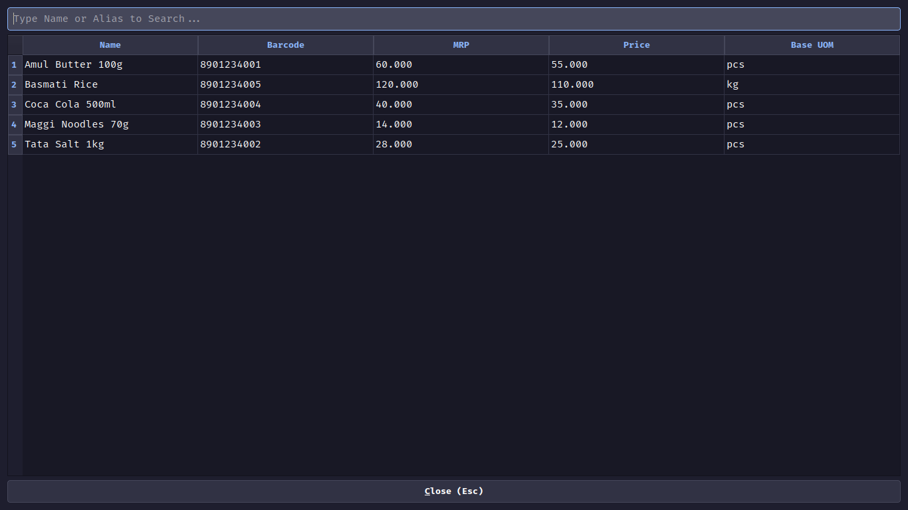
> Advanced fuzzy search for finding products by name, barcode, or alias.

## 📦 Inventory & Procurement
### Item Master
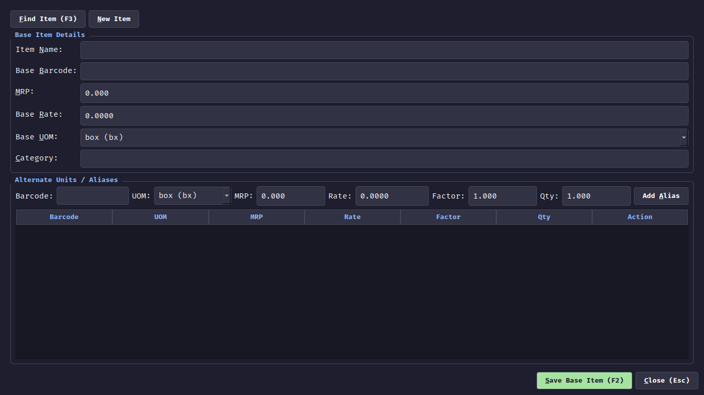
> Comprehensive product management including base UOMs, aliases, and pricing.

### Purchase Entry
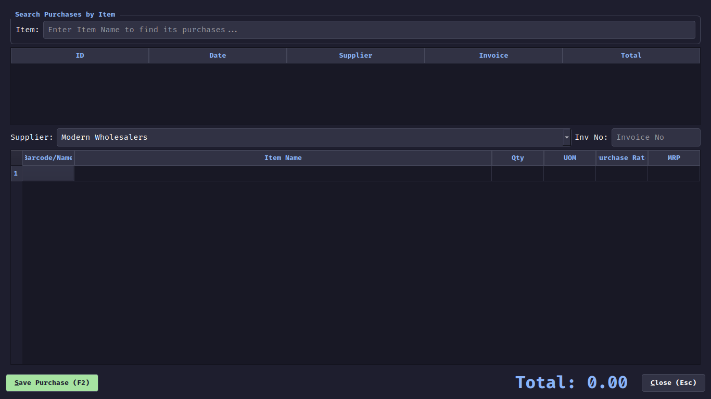
> Record and track purchases from suppliers with full item breakdowns.

## 💰 Schemes & Promotions
### Scheme Designer
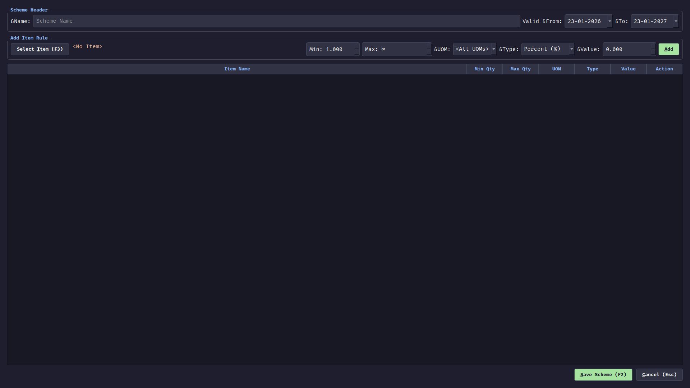
> Create complex promotional rules based on quantity, UOM, and date ranges.

### Scheme List
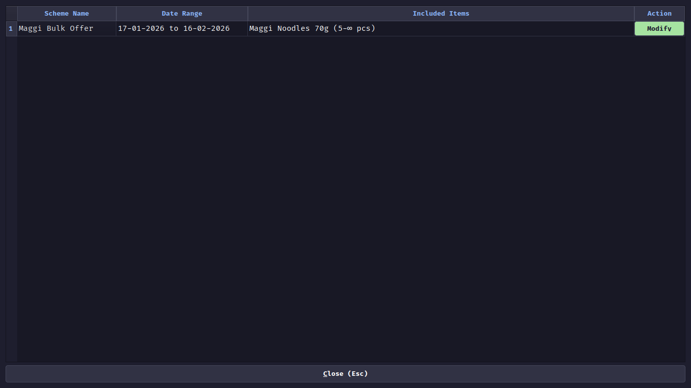
> Overview of all active and scheduled promotional schemes.

## 👥 Relationship Management
### Customer CRM
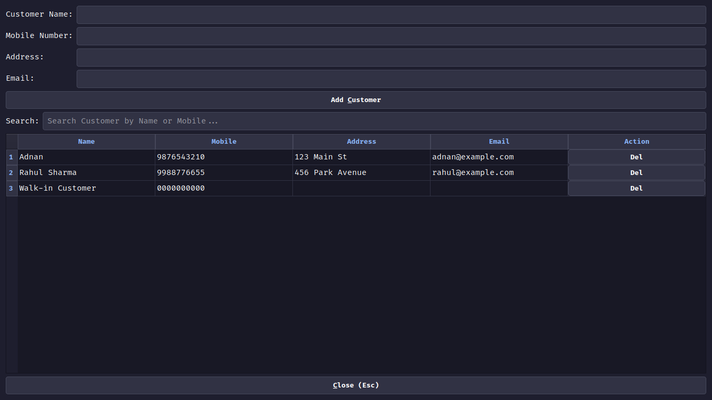
> Integrated customer database for tracking transaction history and details.

## 🖨️ Advanced Receipt Designer
### Classic Theme Preview

> Professional POS layout inspired by traditional thermal receipts.

### Modern Theme Preview

> High-contrast, structured layout for modern retail environments.

### Minimal Theme Preview

> Elegant and spacious design for a premium checkout experience.

## 🌍 Localization
### Language Master
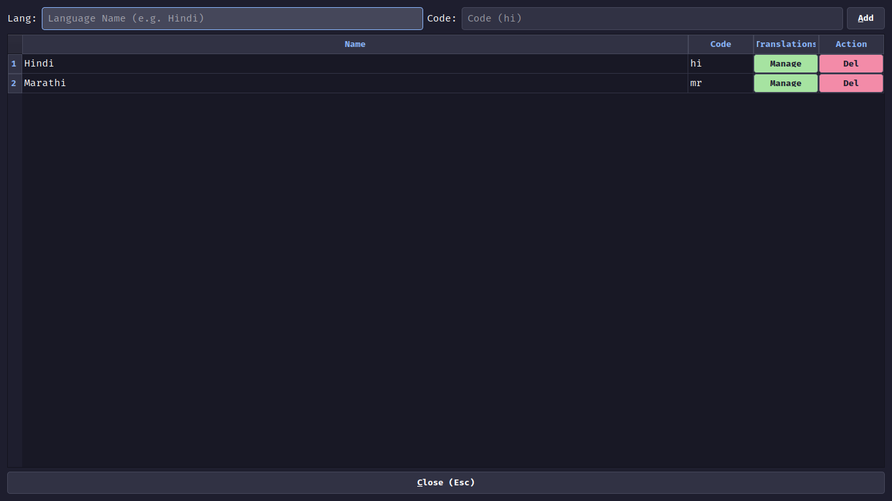
> Configure multiple languages for the system.

### Item Translation
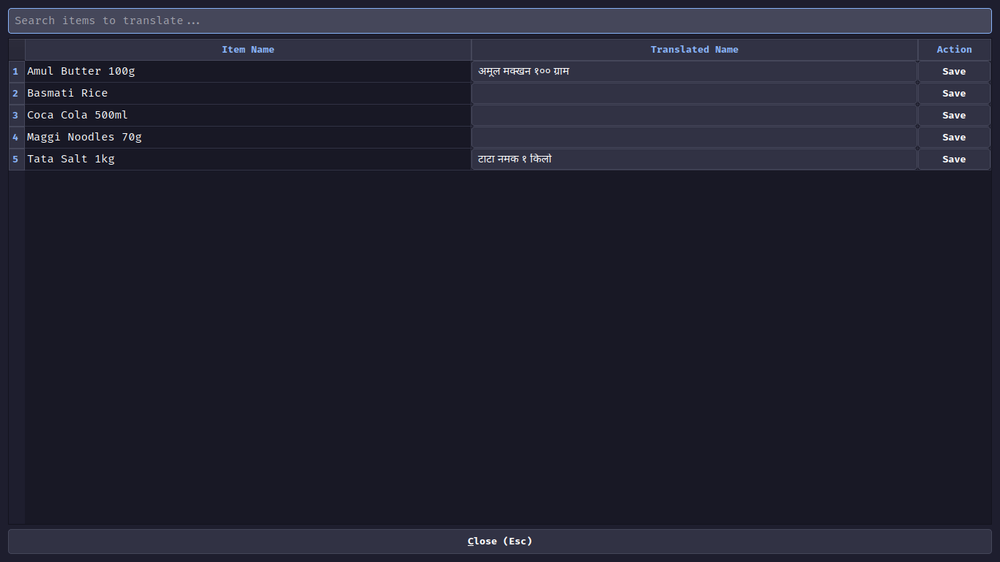
> Manage multi-language translations for every product in your inventory.

## 🛠️ Maintenance & Tools
### Database Tools
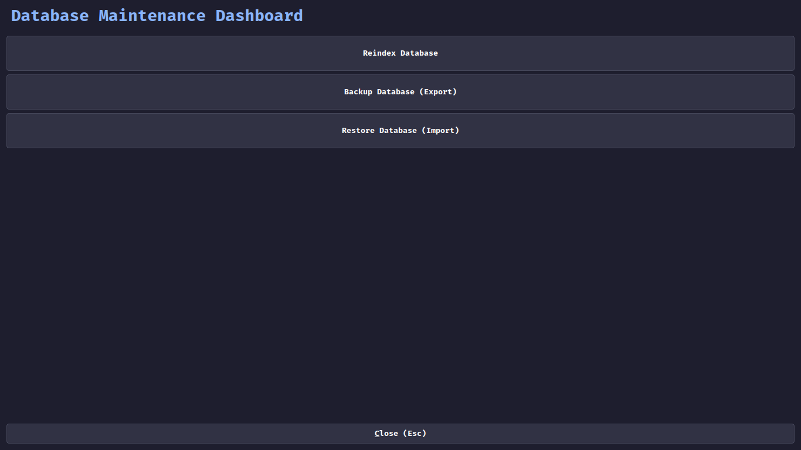
> Built-in tools for reindexing, backing up, and restoring the database.

### Recycle Bin
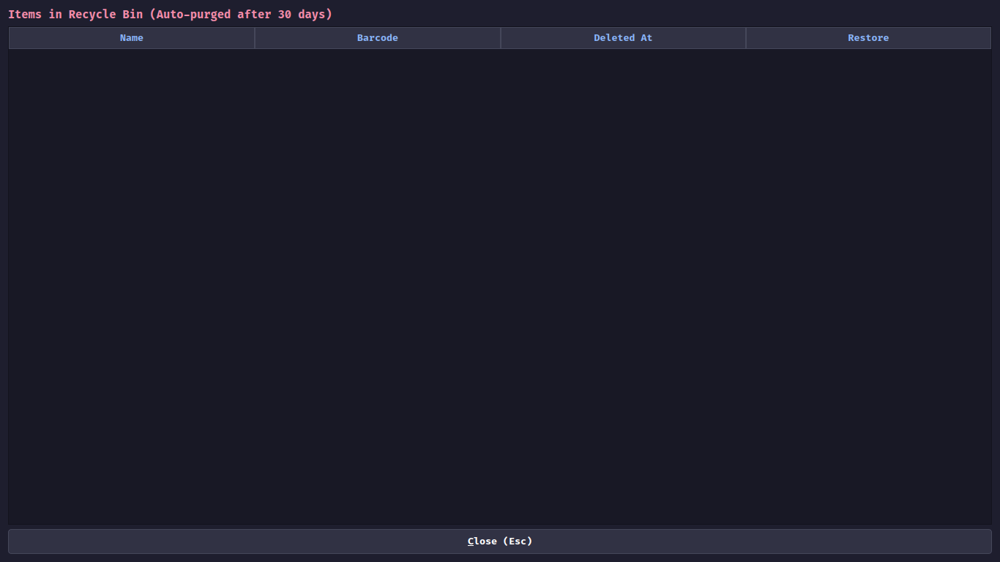
> Safety net for restoring deleted items within 30 days.

### Integrated Calculator
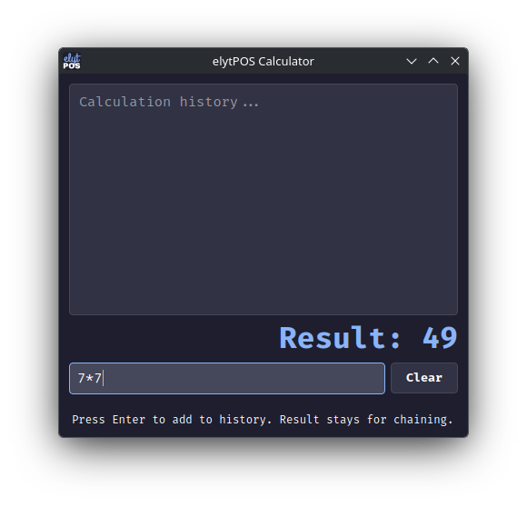
> Seamless, non-modal calculator for quick mathematical operations.